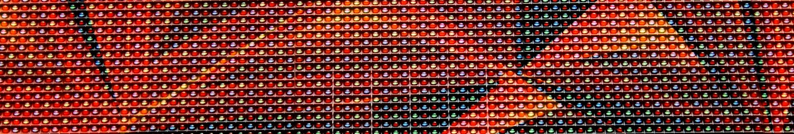

<!-- PROJECT HEADER -->
<div align="center">
  <h1 align="center">Led Matrix Controller</h1>
  
  <p align="center">
    Awesome self rendered animations for common led matrices.
  </p>
</div>

## Getting Started

On your rpi:
1. Install [Rust][Rust-installation-guide]
2. clone repo
3. ```./code/run.sh```
4. done

More tips:
- [Headless raspberry pi setup][Headless-rpi-setup]

## Simulate Display

On your pc:
1. Install [Rust][Rust-installation-guide]
2. clone repo
3. ```./code/run.sh run --simulate```
4. done

## Cross Compile

The detailed [guide][Rust-cross-compile] covers most of the information.
The rpi-led-matrix lib is more difficult to cross compile.
Configure the ```CrossCompileConfig.toml``` to use the right compiler
and also configure ```run.sh``` to use the right target host.

Then run
```./code/run.sh --deploy```.

## Remote Debugging

Configure ```run.sh```.

Then run ```./code/run.sh --gdbserver``` in one terminal
and use Bundled GDB for remote debugging.

## Built With
[![Next][Rust]][Rust-url]

## License
Distributed under the GNU General Public License v3.0. See `LICENSE.txt` for more information.


<!-- MARKDOWN LINKS & IMAGES
Banner: https://torange.biz/photofxnew/207/HD/polygonal-red-metal-texture-led-207754.jpg
-->
[Rust]: https://img.shields.io/badge/rust-000000?style=for-the-badge&logo=rust&logoColor=white
[Rust-url]: https://www.rust-lang.org/
[Headless-rpi-setup]: https://www.tomshardware.com/reviews/raspberry-pi-headless-setup-how-to,6028.html
[Rust-installation-guide]: https://www.rust-lang.org/tools/install
[Rust-cross-compile]: https://github.com/japaric/rust-cross/blob/master/README.md

